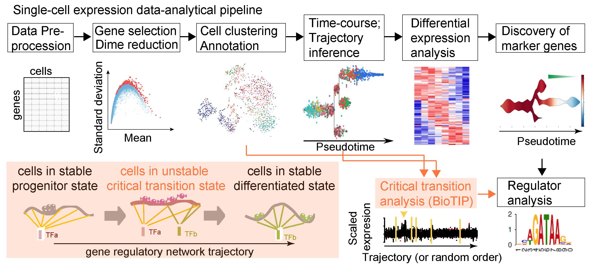
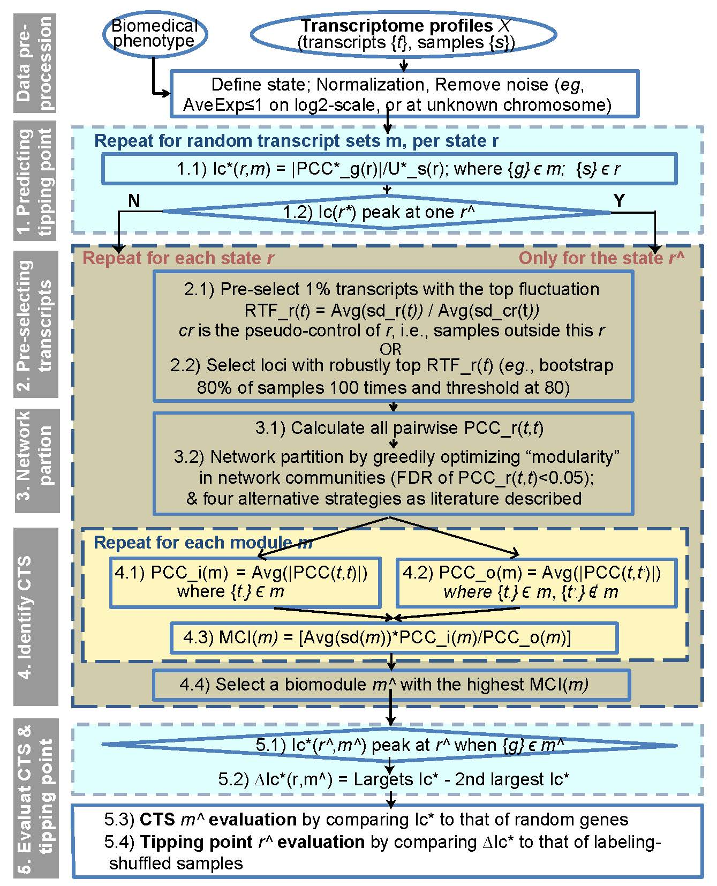

### Introduction
BioTIP is an R-package for characterization of biological tipping-points. Abrupt and irreversible changes (or tipping points) are decisive in the progression of biological processes. BioTIP addresses two computational impediments: detection of tipping-points accurately, and identification of non-chaotic critical transition signals (CTSs). BioTIP is tested with disease and normal developmental systems, covering bulk-cell and single-cell transcriptomes. BioTIP has successfully identified temporal features of gene-regulatory-network dynamics for phenotypically-defined tipping points, which can be exploited to infer the role of key transcription factors. 



Overview of BioTIP.



### Installation
To use the newest BioTIP package, either clone/download this repository, or you can install BioTIP with:

```r
library("devtools")
devtools::install_github("xyang2uchicago/BioTIP")
```

You can install the released version of BioTIP from [CRAN](https://CRAN.R-project.org) with:

``` r
install.packages("BioTIP")
```
or even better
``` r
source('http://bioconductor.org/biocLite.R')
biocLite("BioTIP")
```

### Example
This is a basic example which shows you how to solve a common problem:

```{r example}
library(BioTIP)
data(GSE6136_matrix)
row.names(GSE6136_matrix) = GSE6136_matrix$ID_REF
GSE6136 = GSE6136_matrix[,-1]

data(GSE6136_cli)
cli = t(GSE6136_cli)

library(stringr)
colnames(cli) = str_split_fixed(cli[1,],'_',2)[,2]
cli = cli[-1,]
cli = data.frame(cli)
cli[,"cell-type:ch1"] = str_split_fixed(cli$characteristics_ch1.1,": ",2)[,2]
cli[,"Ig clonality:ch1"] = str_split_fixed(cli$characteristics_ch1.3,": ",2)[,2]

colnames(cli)[colnames(cli) == "cell-type:ch1"] = "group"
cli$Row.names = cli[,1]

df <- log2(dat+1)

tmp <- names(table(cli$group))
samplesL <- split(cli[,1],f = cli$group)
test <- sd_selection(df, samplesL,0.01)
igraphL <- getNetwork(test, fdr = 0.05)
cluster <- getCluster_methods(igraphL)
membersL_noweight <- getMCI(cluster,test,adjust.size = F)
plotBar_MCI(membersL_noweight,ylim = c(0,6))
```

Here are example analysis with bulk and single-cell data sets
[BioTIP Applications](https://github.com/xyang2uchicago/BioTIP_application)

## Enjoy!

