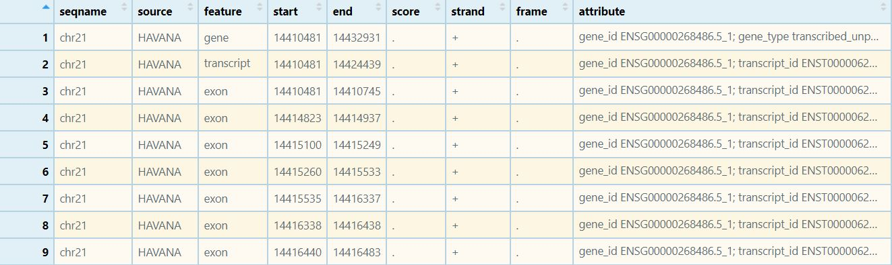

#### ####

```{r, include = FALSE}
knitr::opts_chunk$set(
  collapse = TRUE,
  comment = "#>"
)
```

```{r, echo=FALSE, fig.cap="Fig 1. BioTIP workflow with five key analytic steps. RTF: relative transcript fluctuation; PCC: Pearson correlation coefficient; MCI: Module-Criticality Index; Ic: index of critical transition.", fig.align='center', out.width = '60%'}
knitr::include_graphics("Fig1.pdf")
```

#### [Standard workflow](#Standard workflow)
   * [An Identification of Critical Tipping Point](#An Identification of Critical Tipping Point)
     *  ##### [Data Preprocessing](#Data Preprocessing)
     *  ##### [Pre-selection Transcript](#Pre-selection Transcript)
     *  ##### [Network Partition](#Network Partition)
     *  ##### [Identifying Dynamic Network Biomodule](#Identifying Dynamic Network Biomodule)
     *  ##### [Finding Tipping Point](#Finding Tipping Point)
   * [Transcript Annotation and Biotype](#Transcript Annotation and Biotype)
     *  ##### [Quick Start](#Quick Start)
     *  ##### [Genomic Data Source](#Genomic Data Source)
     *  ##### [Extracting Summary Data](#Extracting Summary Data)
     *  ##### [Loading Data](#Loading Data)
     *  ##### [Prepare GRanges Object](#Prepare GRanges Object)
   * [Acknowledgements](#Acknowledgements)
   * [SessionInfo](#SessionInfo)
   * [References](#References)

<a name="An Identification of Critical Tipping Point"></a>

######################################################################
### Standard workflow: An Identification of Critical Tipping Point ###
######################################################################

<a name="Data Preprocessing"></a>
 __Data Preprocessing__

An existing dataset, GSE6136, is used to demonstrate how our functions are applied. Samples were collected from transgenic mouse lymphomas and divided into five groups based on clinical presentation, pathology and flow cytometry (Lenburg 2007), thus belonging to cross-sectional profiles. Noticing these five group represent a control stage similar to non-transgenic B cells and four major periods of B-cell lymphomagenesis, Dr. Chen and coauthors used the DNB method to identify the pre-disease state exists around the normal activated period (P2), i.e., the system transitions to the disease state around the transitional lymphoma period (Figure S12 in publication (Chen 2012)). 
Start by installing the package 'BioTIP' and other dependent packages such as stringr, psych, and igraph if necessary. Below are some examples.

```{r}
# load package
library(BioTIP)
```

Once all the required packages are installed, load using `“read.table()”` function as follows. Note to change the read.table(“PATH”) when running your datasets. To check the dimension of your data set use “dim(dataset)” function. Here we show a use of dim function “dim(GSE6136)”. Notice that after editing the column and row, the dimension of our dataset changes from (22690,27) to (22690, 26) because we removed the downloaded first row after assigning it to be column-name of the final numeric data matrix.

```{r}
data(GSE6136_matrix)

dim(GSE6136_matrix)               #[1] 22690 genes and 27 samples (cells) 
row.names(GSE6136_matrix) = GSE6136_matrix$ID_REF
GSE6136 = GSE6136_matrix[,-1]
dim(GSE6136)               #[1] 22690 genes and 26 samples (cells) 
```

  The summary of GSE6136_matrix is GSE6136_cli shown below. These two kind of data files can be downloaded from GSE database

```{r}
#requires library(stringr)
library(BioTIP)
data(GSE6136_cli)

#dim(GSE6136_cli) #check dimension
cli = t(GSE6136_cli)

library(stringr)
colnames(cli) = str_split_fixed(cli[1,],'_',2)[,2]
cli = cli[-1,]
cli = data.frame(cli)
cli[,"cell-type:ch1"] = str_split_fixed(cli$characteristics_ch1.1,": ",2)[,2]
cli[,"Ig clonality:ch1"] = str_split_fixed(cli$characteristics_ch1.3,": ",2)[,2]

colnames(cli)[colnames(cli) == "cell-type:ch1"] = "group"
cli$Row.names = cli[,1]
head(cli[,1:3])
```

  We normalized the expression of genes using log2() scale. This normalization 
  will ensure a more accurate comparison of the variance between the expression
  groups (clusters).

```{r}
dat <- GSE6136
df <- log2(dat+1)
head(df)
```

<a name=>[Go to Top](#)</a> 
<a name="Pre-selection Transcript"></a>

 __Pre-selection Transcript__

  Once normalized, we can now classify different stages. The tipping point
  is within the "activated" state in this case. Here we see the number of
  samples that are classified into states "activated", "lymphoma_aggressive",
  "lymphoma_marginal", "lymphoma_transitional" and "resting". For instance,
  states "activated" and "resting" contain three and four samples, respectively.
  All the contents of the data set "test" can be viewed using `View(test)`. Each
  clinical state's content can be viewed using `head(test["stage_name"])`. For
  instance, head(test["activated"]) shows contents of the activated state.

```{r warning=FALSE}
cli$group = factor(cli$group,
                   levels = c('resting','activated','lymphoma_marginal','lymphoma_transitional','lymphoma_aggressive'))
samplesL <- split(cli[,"geo_accession"],f = cli$group)
lapply(samplesL, length)
test <- sd_selection(df, samplesL,0.01)
head(test[["activated"]])
```

<a name=">[Go to Top](#)</a> 
<a name="Network Partition"></a>

 __Network Partition__

  A graphical represetation of genes of interest can be achieved using the
  functions shown below. The `getNetwork` function will obtain an igraph object
  based on a pearson correlation of `test`. This `igraphL` object is then run
  using the `getCluster_methods` function classify nodes.

```{r,echo=TRUE, warning=FALSE}
igraphL <- getNetwork(test, fdr = 1)
cluster <- getCluster_methods(igraphL)
```
```{r,echo=TRUE, warning=FALSE}
names(cluster)
head(cluster[[1]])
```

<a name=">[Go to Top](#)</a> 
<a name="Identifying Dynamic Network Biomodule"></a>

 __Identifying Dynamic Network Biomodule__

Here, ‘module’ refers to a cluster of network nodes (e.g. transcripts) highly linked (e.g. by correlation). “Biomodule” refers to the module resenting a highest score called “Module-Criticality Index (MCI)” per state.

  The following step shows a graph of classified clustered samples for five
  different stages. MCI score is calculated for each module using the `getMCI`
  function. The `getMaxMCImember` function will obtain a list of modules with highest
  MCI at each stage. Use `"head(maxCIms)"` to view the MCI scores calculated. Use
  `plotMaxMCI` function to view the line plot of highest MCI score at each stage.

```{r,echo=TRUE, warning=FALSE}
membersL_noweight <- getMCI(cluster,test,adjust.size = FALSE)
plotBar_MCI(membersL_noweight,ylim = c(0,6))
```
```{r,echo=TRUE, warning=FALSE}
maxMCIms <- getMaxMCImember(membersL_noweight[[1]],membersL_noweight[[2]],min =10)
names(maxMCIms)
names(maxMCIms[[1]])
names(maxMCIms[[2]])
```
```{r,echo=TRUE, warning=FALSE}
head(maxMCIms[['idx']])
head(maxMCIms[['members']][['lymphoma_aggressive']])
```


  To get the selected statistics of biomodules (the module that has the highest MCI score) of each state, please run the following 

```{r}
biomodules = getMaxStats(membersL_noweight[['members']],maxMCIms[[1]])
maxMCI = getMaxStats(membersL_noweight[['MCI']],maxMCIms[[1]])
head(maxMCI)
```
```{r}
maxSD = getMaxStats(membersL_noweight[['sd']],maxMCIms[[1]])
head(maxSD)
```

  To get the biomodule with the highest MCI score among all states, as we call it CTS (Critical Transition Signals), please run the following.
  
```{r}
CTS = getCTS(maxMCI, maxMCIms[[2]])
```

 Run the following to visualize the trendence of every state represented by the cluster with the highest MCI scores.
```{r,echo=TRUE, warning=FALSE}
par(mar = c(10,5,0,2))
plotMaxMCI(maxMCIms,membersL_noweight[[2]],states = names(samplesL),las = 2)
```

  We then perform simulation for MCI scores based on identified signature size
  (length(CTS) ) using the `simulationMCI` function.Use `plot_MCI_simulation`
  function to visualize the result. This step usually takes 20-30mins, so here
  to save the time, we picked a small number 3 as the length of the CTS.
  
```{r,echo=TRUE, warning=FALSE}
simuMCI <- simulationMCI(3,samplesL,df)
plot_MCI_Simulation(maxMCI,simuMCI,las=2)
```
<a name="">[Go to Top](#)</a> 


<a name="Finding Tipping Point"></a>
 __Finding Tipping Point__

The next step is to calculate an Index of Critical transition (Ic score) of the dataset. First, use the getIc function to calculate the Ic score based on the biomodule previously identified. We use the plotIc function to draw a line plot of the Ic score. 
  
```{r}
IC <- getIc(df,samplesL,CTS)
par(mar = c(10,5,0,2))
plotIc(IC,las = 2)
```

Then use the two functions to evaluate two types of empirical significance,
respectively. The first function simulation_Ic calculates random Ic-scores by
shuffling features (transcripts). Showing in the plot is Ic-score of the
identification (red) against its corresponding size-controlled random scores
(grey).

```{r,warning=FALSE}
simuIC <- simulation_Ic(length(CTS),samplesL,df)
par(mar = c(10,5,0,2))
plot_Ic_Simulation(IC,simuIC,las = 2)
```
  
Another function plot_simulation_sample calculates random Ic-scores by shuffling
samples and visualizes the results. Showing in the plot is observed Ic-score
(red vertical line) comparing to the density of random scores (grey), at the
tipping point identified.

```{r}
sample_Ic = simulation_Ic_sample(df, sampleNo=3, genes=CTS, plot=TRUE)
#simulated_Ic = plot_simulation_sample(df,length(samplesL[['lymphoma_aggressive']]),IC[['lym#phoma_aggressive']],CTS) 
```

<a name=">[Go to top](#)</a>
<a name="Transcript Annotation and Biotype"></a>


###################################################
###Transcript Annotation and Biotype###
###################################################

<a name="Quick Start"></a>

 __Quick Start__

  The R function getBiotype is used to group transcripts of interest into 11
  biotypes based on GENCODE annotation (Fig 2a). When a query transcript
  overlaps at least half with a GENCODE transcript on the same strand, this
  query transcript will inherit the biotype of the GENCODE transcript.

  In the previous study conducted, five out of the 11 biotypes showed high
  protein-coding potential while the others did not (Fig 2b) [4]. We thus
  concluded these seven other biotypes, including protein-coding antisense RNAs,
  to be lncRNAs. The remaining coding biotypes in this study included canonic
  protein coding (CPC), ‘PC_mixed’, and ‘PC_intron’.

  First start by loading the required libraries: “GenomeInfoDb,” “BioTIP,”
  “GenomicRanges,” “IRanges” and “BioTIP”. Next load the datasets: “gencode”,
  “ILEF”, “intron” and “cod”. Using these datasets, excute BioTIP functions
  getBiotypes and getReadthrough as follows. These steps assume you installed
  the “BioTIP” package. If you did not install the package, use the
  `install.packages("BioTIP")` to install in R.

```{r, echo=FALSE, fig.align='center', out.width = '65%'}
knitr::include_graphics("Fig2.jpg")
```

Fig 2. A getBiotypes workflow and protein-coding potential in real data analysis
[4]. (a) Workflow of an in-house R function (getBiotypes) to query transcripts
of interests and classify into biotypes. (b) Pie-chart of eleven types of
transcripts assembled from polyadenylated RNA(TARGET). (c) Empirical cumulative
distribution plot comparing the transcripts across all 11 biotypes. The
protein-coding potential was estimated with the Coding Potential Assessment Tool
(CPAT). Line color codes biotypes. The more a line towards the right-bottom
corner, the lower protein-coding potential it has.

```{r}
library(BioTIP)

data(gencode)
head(gencode)
```

  These illustrations above assumes you have installed "BioTIP" package. If you did
  not install the package already, use the `install.packages("BioTIP")` to install in R.

<a name="Genomic Data Source"></a>\

 __Genomic Data Source__ 

High quality human genome sequence data can be obtained from various sources. To
demonstrate this package, we obtained a comprehensive gene annotation of human
GRCh37 from [GENCODE](https://www.gencodegenes.org/human). For our
illustrations, human GRCh37 data will be used. A standard file structure,
similar to general transfer format (gtf) format, is required for this package.
This gtf file organizes genomic data in rows and columns (fields). Each row
contains information about specific samples. The columns are tab separated
headers of the data frame.  There are eight fixed columns with specific headers.
An example of gtf format is shown below. For details of the gtf file format
visit this
[link](https://useast.ensembl.org/info/website/upload/gff.html#tracklines
target="_blank").


   

The table above contains a chr21 dataset which was extracted from a full genome
dataset. An extraction method for filtering chr21 from `gencode` file is
described below.


<a name=>[Go to Top](#)</a> 
<a name="Extracting Summary Data"></a>\

 __Extracting Summary Data__

  Before any further analysis, we need to summarize the content of the raw gtf
  data. There are two ways to get genome biotypes: a) "transcript_type" b)
  "gene_type". Due to our interst in coding and noncoding regions, the
  `transcript_type` method was used to extract the regions of interest using
  python script shown below. __Note__ that the `"PATH_FILE"` refers to the path
  where the downloded gtf file is located. For instance, if the gtf file is
  located on your `desktop`, replace the `"PATH_FILE"` Cc
  `"Users/user/Desktop/gtf"`.

**Python codes:**

```{r "python code", eval = FALSE}
gtf = ("Your/PATH/TO/THE/FILE")
outF = open("gtf_summary_transbiotype.txt","w")

def getquote(str,f,target):
    targetLen = len(target)+2
    strInd = str.find(target)
    st = strInd + len(target)+2
    ed = st + str[st:].find("";")
    #print(st,ed)
    f.write("\t"+str[st:ed]) if strInd!= -1 else f.write("\t"+"NA.")

with open(gtf, "r") as f:
     for line in f:
        if line[0] != "#":
            chromosome = line.split("\t")[0]
            st = line.split("\t")[3]
            ed = line.split("\t")[4]
            strand = line.split("\t")[6]
            type = line.split("\t")[2]
            outF.write(chromosome+"\t"+st+"\t"+ed+"\t"+strand+"\t"+type)
            c = "transcript_id"
            g = "gene_name"
            t = "transcript_type"
            getquote(line,outF,c)
            getquote(line,outF,g)
            getquote(line,outF,t)
            outF.write("\n")
outF.close() 
```
***

<a name="Home">[Go to Top](#)</a>
<a name="Loading Data"></a>\ 

 __Loading Data__

In order to load your data from a local drive, use the following format.
  __Note__ that the `"PATH_FILE"` refers to the location of the summary data
  from the above section. For more details on how to load datasets click
  [here](https://support.rstudio.com/hc/en-us/articles/218611977-Importing-Data-with-RStudio).


##### loading data from local drive
 > data <- read.delim("PATH_FILE", comment.char = "#")

  Internal BioTIP package data is included in the data folder. The data can be
  loaded into R working console using `data()`function. Here we show an example
  of how to load a dataset `gencode` from the data directory. A quick view of
  the data can be achieved using `head(gencode)`.

```{r}
library(BioTIP)
library(GenomicRanges)
data(gencode)
head(gencode)
```
<a name="Home">[Go to Top](#)</a>

<a name="Prepare GRanges Object"></a>\ 

 __Prepare GRanges Object__

  Here we show an extraction of "gencode" dataset using R commands. Note
  to replace `PATH_FILE` with file direcotry path. `gtf` refers to the full 
  genome file. A subset function was used to filter chr21 dataset as follows.

`chr21 <- subset(gencode, seqnames == "chr21")` #"genecode" = whole genome gtf

    > gtf = read.table("PATH_FILE")
    > gtf = subset(gtf, biotype == "transcript")
    > colnames(gtf) = c("chr","start","end","strand","biotype")
    > gr = GRanges(gtf)

<a name="Home">[Go to Top](#)</a> 


##### Processing Query
***

```{r}
query <- GRanges(c("chr1:2-10:+","chr1:6-10:-"), Row.names = c("trans1","trans2"), score = c(1,2))
head(query)

```

##### Classifying Biotypes
***

```{r}
library(BioTIP)
gr <- GRanges(c("chr1:1-5:+","chr1:2-3:+"),biotype = c("lincRNA","CPC"))
head(gr)
```

##### Extracting intron coordinates
*** 

      # Intron coordinates
      
       intron <- GRanges("chr1:6-8:+")
  
```{r}

intron <- GRanges("chr1:6-8:+")
head(intron)
```

##### Filtering coding transcripts
***

    # Filtering non-coding regions using products from example 1, 2 and 3

```{r}

intron_trncp <- getBiotypes(query, gr, intron)
intron_trncp
```

    # Filtering Intron and Exons 

Here we show how to obtain protein coding and non-coding from our datasets. The
coding transcripts are an expressed section of the genome that is responsible
for protein formation. Meanwhile the non-coding transcripts are vital in the
formation regulatory elements such promoters, enhancers and silencers.

```{r}
library(BioTIP)
data("intron")
data("ILEF")
data("gencode")

gencode_gr = GRanges(gencode)
ILEF_gr = GRanges(ILEF)
cod_gr = GRanges(cod)
intron_gr = GRanges(intron)

non_coding <- getBiotypes(ILEF_gr, gencode_gr, intron_gr)
dim(non_coding)
head(non_coding[,1:3])
```
```{r}
coding <- getBiotypes(ILEF_gr, gencode_gr)
dim(coding)
head(coding[,1:3])
```


##### Finding overlapping transcripts
***
    # Samples with overlapping coding regions.
```{r}
library(BioTIP)

data(ILEF)
data(cod)
ILEF_gr = GRanges(ILEF)
cod_gr = GRanges(cod)

rdthrough <- getReadthrough(ILEF_gr, cod_gr)
head(rdthrough)
```

<a name="Acknowledgements"></a>\

 __Acknowledgements__

  The development of this package would not be possible without continous help
  and feedback from individuals and institutions including: The Bioconductor
  Core Team, Dr. Xianan H Yang, Dr. Tzintzuni Garcia, and National Institutes of
  Health R21LM012619.

<a name="SessionInfo"></a>\

```{r SessionInfo}
sessionInfo()
```
<a name=">[Go to Top](#)</a>
<a name="References"></a>\

 __References__ 

* Scheffer M, Carpenter SR, Lenton TM, Bascompte J, Brock W, Dakos V, et al. Anticipating critical transitions. Science. 2012;338(6105):344-8. doi: 10.1126/science.1225244. PubMed PMID: 23087241.
* Chen L, Liu R, Liu ZP, Li M, Aihara K. Detecting early-warning signals for sudden deterioration of complex diseases by dynamical network biomarkers. Sci Rep. 2012;2:342. Epub 2012/03/31. doi: 10.1038/srep00342. PubMed PMID: 22461973; PubMed Central PMCID: PMC3314989.
* Lenburg, M. E., A. Sinha, D. V. Faller and G. V. Denis (2007). "Tumor-specific and proliferation-specific gene expression typifies murine transgenic B cell lymphomagenesis." J Biol Chem 282(7): 4803-4811.PMC2819333
* Moris, N., C. Pina and A. M. Arias (2016). “Transition states and cell fate decisions in epigenetic landscapes.” Nat Rev Genet 17(11): 693-703. PMID: 27616569.
* Mojtahedi M, Skupin A, Zhou J, Castano IG, Leong-Quong RY, Chang H, et al. Cell Fate Decision as High-Dimensional Critical State Transition. PLoS Biol. 2016;14(12):e2000640. doi: 10.1371/journal.pbio.2000640. PubMed PMID: 28027308; PubMed Central PMCID: PMCPMC5189937.
* Wang, Z. Z., J. M. Cunningham and X. H. Yang (2018). “CisPi: a transcriptomic score for disclosing cis-acting disease-associated lincRNAs.” Bioinformatics34(17): 664-670"


