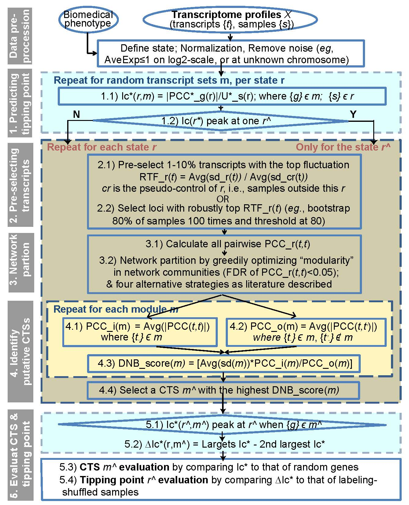
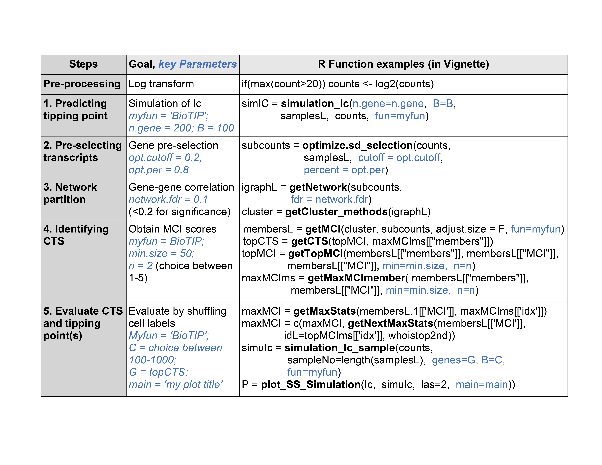
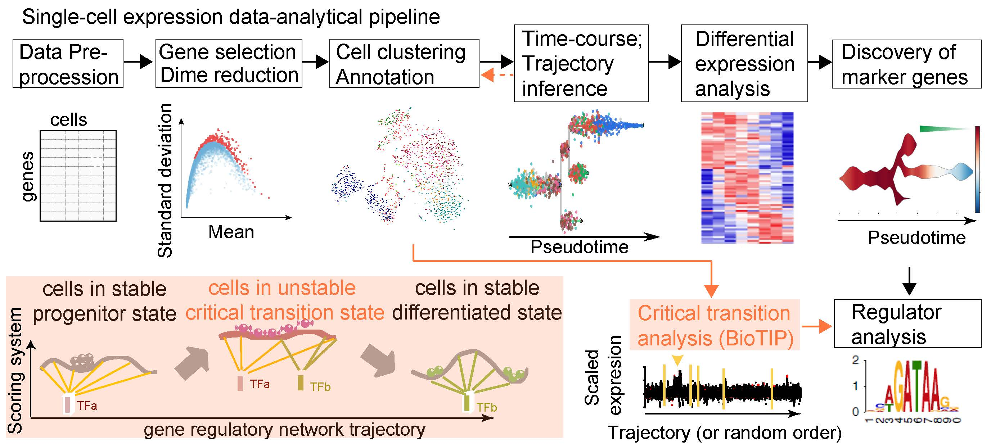
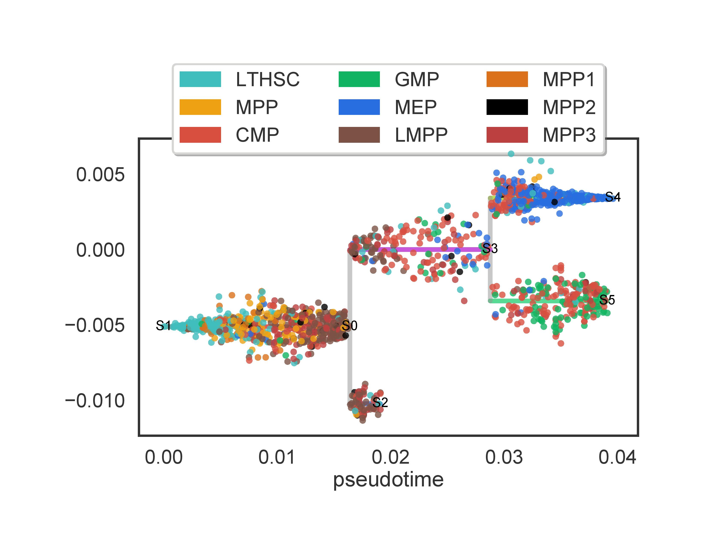
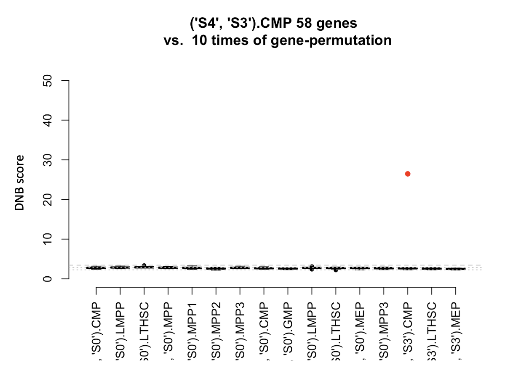
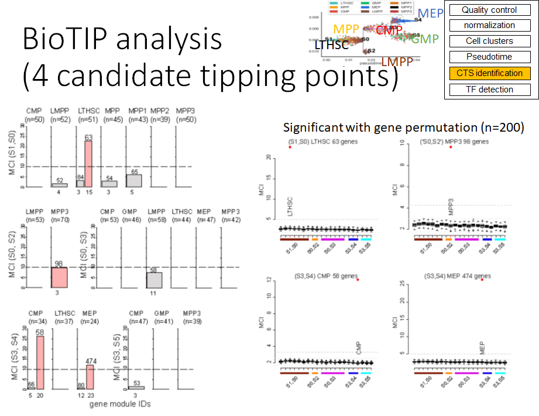
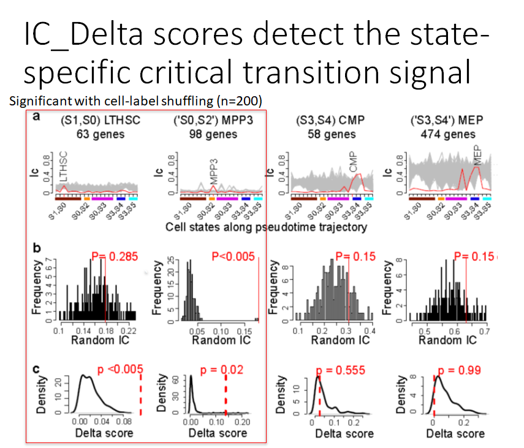

```{r, include = FALSE}
knitr::opts_chunk$set(
  collapse = TRUE,
  comment = "#>"
)
```


#### [Standard Workflow](#Standard workflow)

We designed the BioTIP workflow in the following five steps (Fig 1). In this workflow, two steps (Steps 2 and 5) calculated the random scores from randomly selected genes. In step 2, the distribution of random scores is designed to predict the potential tipping point. The rationale is that random genes can, in cases, capture the "symmetry-breaking destabilization" at tipping points (Mojtahedi 2016). In step 5, the random scores are used to validate the significance of the predicted critical transition signals (CTSs). A CTS measures the loss of resilience of previous states and the gain of instability during transitions (Scheffer, 2012). Because a CTS could be both "regulated" or "chaotic", the detection of non-random CTSs is important and has successes in development and diseases (Chen, 2012, Sarkar, 2019). The same R function (Table 1) can be used to calculate the random scores, for which we demonstrate the implication of Step 5 in the two following sections. 


```{r, echo=FALSE, fig.cap="Fig 1. BioTIP workflow with five key analytical steps. RTF: relative transcript fluctuation; PCC: Pearson correlation coefficient; DNB: Dynamic Network Biomarker, of which the score was called as Module-Criticality Index (MCI) in the R package BioTIP; Ic: index of critical transition.; Ic*: our redefined Ic, which is also referred to as the BioTIP score", fig.align='center', out.width = '60%'}

```

```{r, echo=FALSE, fig.cap="Table 1. The key R functions and customaized parameters for the five analytical steps.", fig.align='center', out.width = '60%'}

```
   * [An Identification of Critical Tipping Point using Bulk RNA-seq](#An Identification of Critical Tipping Point using Bulk RNA-seq)
     *  ##### [Data Preprocessing](#Data Preprocessing)
     *  ##### [Pre-selection Transcript](#Pre-selection Transcript)
     *  ##### [Network Partition](#Network Partition)
     *  ##### [Identifying putative Critical Transition Signals (CTS) using the DNB Module](#Identifying putative Critical Transition Signals (CTS) using the DNB Module)
     *  ##### [Finding Tipping Point and Evaluating CTS](#Finding Tipping Point and Evaluating CTS)
   * [Applying to scRNA-seq Data](#Applying to scRNA-seq Data)
     *  ##### [Advanced Estimation for Pearson Correlation Coefficient Matrix](#Advanced Estimation for Pearson Correlation Coefficient Matrix) 
     *  ##### [Data Preprocessing with Trajectory Building Tools](#Data Preprocessing with Trajectory Building Tools)
     *  ##### [Predicting Tipping Point (Advanced Index of Critical Transition (IC*))](#Predicting Tipping Point (Advanced Index of Critical Transition (IC*)))
     *  ##### [Gene Pre-selection](#Gene Pre-selection)
     *  ##### [Network Partition](#Network Partition2)
     *  ##### [Identifying putative Critical Transition Signals (CTS) using the DNB Module](#Identifying putative Critical Transition Signals (CTS) using the DNB Module)
     *  ##### [Finding Tipping Point and Evaluating CTS](#Finding Tipping Point and Evaluating CTS)
     *  ##### [Inferring Tipping Point-Driven Transcription Factors](#Inferring Tipping Point-Driven Transcription Factors)
   * [Transcript Annotation and Biotype](#Transcript Annotation and Biotype)
     *  ##### [Quick Start](#Quick Start)
     *  ##### [Genomic Data Source](#Genomic Data Source)
     *  ##### [Extracting Summary Data](#Extracting Summary Data)
     *  ##### [Loading Data](#Loading Data)
     *  ##### [Prepare GRanges Object](#Prepare GRanges Object)
   * [Acknowledgements](#Acknowledgements)
   * [SessionInfo](#SessionInfo)
   * [References](#References)

<a name="An Identification of Critical Tipping Point using Bulk RNA-seq"></a>

######################################################################
### An Identification of Critical Tipping Point using Bulk RNA-seq###
######################################################################

<a name="Data Preprocessing"></a>
 __Data Preprocessing__

An existing dataset, GSE6136, is used to demonstrate how our functions are applied. Samples were collected from transgenic mouse lymphomas and divided into five groups based on clinical presentation, pathology and flow cytometry (Lenburg 2007), thus belonging to cross-sectional profiles. Noticing these five group represent a control stage similar to non-transgenic B cells and four major periods of B-cell lymphomagenesis, Dr. Chen and coauthors used the DNB method to identify the pre-disease state exists around the normal activated period (P2), i.e., the system transitions to the disease state around the transitional lymphoma period (Figure S12 in publication (Chen 2012)). 
Start by installing the package 'BioTIP' and other dependent packages such as stringr, psych, and igraph if necessary. Below are some examples.

```{r, warning=FALSE, message=FALSE}
# load BioTIP and dependent packages
library(BioTIP)
library(cluster)
library(GenomicRanges)
library(Hmisc)
library(MASS)
require(stringr)
require(psych)
require(igraph)
```

Once all the required packages are installed, load the GEO-downloaded gene expression matrix as follows. Notice that we removed the downloaded first row after assigning it to be column-name of the final numeric data matrix.

```{r}
data(GSE6136_matrix)
dim(GSE6136_matrix)  
row.names(GSE6136_matrix) = GSE6136_matrix$ID_REF

# remove the downloaded first row after assigning it to be column-name of the final numeric data matrix
GSE6136 = GSE6136_matrix[,-1]
dim(GSE6136) 
```

The summary of GSE6136_matrix is the GSE6136_cli shown below. These two data files can be downloaded from GEO database. 

```{r}
data(GSE6136_cli)
##dim(GSE6136_cli) optional: check dimension

cli = t(GSE6136_cli)

colnames(cli) = str_split_fixed(cli[1,],'_',2)[,2]
cli = cli[-1,]
cli = data.frame(cli)
cli[,"cell-type:ch1"] = str_split_fixed(cli$characteristics_ch1.1,": ",2)[,2]
cli[,"Ig clonality:ch1"] = str_split_fixed(cli$characteristics_ch1.3,": ",2)[,2]

colnames(cli)[colnames(cli) == "cell-type:ch1"] = "group"
cli$Row.names = cli[,1]
head(cli[,1:3])
```

We normalized the expression of genes using log2() transformation. This normalization will ensure a more accurate comparison of the variances between expression groups, or clusters.

```{r}
dat <- GSE6136
df <- log2(dat+1)
head(df[,1:6])
```

<a name=>[Go to Top](#)</a> 
<a name="Pre-selection Transcript"></a>

__Pre-selection Transcript__

Once normalized, we can now classify the different stages. The tipping point is within the "activated" state in this case. Here we see the number of samples that are classified into states "activated", "lymphoma_aggressive", "lymphoma_marginal", "lymphoma_transitional" and "resting". For instance, states "activated" and "resting" contain three and four samples, respectively. All the contents of the data set "test" can be viewed using `View(test)`. The contents of each clinical state can be viewed using the `head` function. 

```{r warning=FALSE}
cli$group = factor(cli$group,
                   levels = c('resting','activated','lymphoma_marginal','lymphoma_transitional','lymphoma_aggressive'))
samplesL <- split(cli[,"geo_accession"],f = cli$group)
lapply(samplesL, length)
test <- sd_selection(df, samplesL,0.01)
head(test[["activated"]])
```

[Go to Top](#)</a> 
<a name="Network Partition"></a>

 __Network Partition__

  A graphical represetation of genes of interest can be achieved using the
  functions shown below. The `getNetwork` function will obtain an igraph object
  based on a pearson correlation of `test`. This `igraphL` object is then run
  using the `getCluster_methods` function classify nodes.

```{r, warning=FALSE}
igraphL <- getNetwork(test, fdr = 1)
cluster <- getCluster_methods(igraphL)
```
```{r,echo=TRUE, warning=FALSE}
names(cluster)
```

[Go to Top](#)</a> 
<a name="Identifying putative Critical Transition Signals (CTS) using the DNB Module"></a>

__Identifying putative Critical Transition Signals (CTS) using the DNB Module__

Here, ‘module’ refers to a cluster of network nodes (e.g. transcripts) highly linked (e.g. by correlation). “Biomodule” refers to the module representing the score called “Module-Criticality Index (MCI)” per state.

  The following step shows a graph of classified clustered samples for five
  different stages. MCI score is calculated for each module using the `getMCI`
  function. The `getMaxMCImember` function will obtain a list of modules with highest MCI at each stage,      where the parameter min sets the minimal number of genes required in a module. Use `"head(maxCIms)"` to     view the MCI scores calculated. Use `plotMaxMCI` function to view the MCI score at each stage.

```{r,echo=TRUE, warning=FALSE}
membersL_noweight <- getMCI(cluster,test)
plotBar_MCI(membersL_noweight,ylim = c(0,6))
```
```{r,echo=TRUE, warning=FALSE}
maxMCIms <- getMaxMCImember(membersL_noweight[[1]],membersL_noweight[[2]],min =10)
names(maxMCIms)
names(maxMCIms[[1]])
names(maxMCIms[[2]])
```
```{r,echo=TRUE, warning=FALSE}
head(maxMCIms[['idx']])
head(maxMCIms[['members']][['lymphoma_aggressive']])
```

To get the selected statistics of biomodules (the module that has the highest MCI score) of each state, please run the following commands:

```{r}
biomodules = getMaxStats(membersL_noweight[['members']],maxMCIms[[1]])
maxMCI = getMaxStats(membersL_noweight[['MCI']],maxMCIms[[1]])
maxMCI = maxMCI[order(maxMCI,decreasing=TRUE)]
head(maxMCI)
topMCI = getTopMCI(membersL_noweight[[1]],membersL_noweight[[2]],membersL_noweight[['MCI']],min =10)
head(topMCI)
```
```{r}
maxSD = getMaxStats(membersL_noweight[['sd']],maxMCIms[[1]])
head(maxSD)
```

To get the biomodule with the MCI score among all states, as we call it CTS (Critical Transition Signals), please run the following command:
  
```{r}
CTS = getCTS(topMCI, maxMCIms[[2]])
```

Run the following commands to visualize the trendence of every state represented by the cluster with the highest MCI scores: 
```{r,echo=TRUE, warning=FALSE}
par(mar = c(10,5,0,2))
plotMaxMCI(maxMCIms,membersL_noweight[[2]],states = names(samplesL),las = 2)
```

We then perform simulation for MCI scores based on identified signature size (length(CTS) ) using the `simulationMCI` function. Use `plot_MCI_simulation`function to visualize the result. This step usually takes 20-30 minutes, so here we picked a small number 3 as the length of the CTS for demonstration purposes.
  
```{r, warning=FALSE, results=FALSE}
simuMCI <- simulationMCI(3,samplesL,df, B=100)
plot_MCI_Simulation(topMCI[1],simuMCI,las=2)
```

[Go to Top](#)</a> 

<a name="Finding Tipping Point and Evaluating CTS"></a>
 __Finding Tipping Point and Evaluating CTS__

The next step is to calculate an Index of Critical transition (Ic score) of the dataset. First, use the `getIc` function to calculate the Ic score based on the biomodule previously identified. We use the `plotIc` function to draw a line plot of the Ic score. 

```{r}
IC <- getIc(df,samplesL,CTS[[1]],PCC_sample.target = 'average')
par(mar = c(10,5,0,2))
plotIc(IC,las = 2)
```

Then we use the two functions to evaluate two types of empirical significance,
respectively.

The first function `simulation_Ic` calculates random Ic-scores by
shuffling features (transcripts). Showing in the plot is Ic-score of the
identification (red) against its corresponding size-controlled random scores
(grey).

```{r,warning=FALSE, results=FALSE}
simuIC <- simulation_Ic(length(CTS[[1]]),samplesL,df,B=100)
par(mar = c(10,5,0,2))
plot_Ic_Simulation(IC,simuIC,las = 2)
```

Another function `plot_simulation_sample` calculates random Ic-scores by shuffling
samples and visualizes the results. Showing in the plot is observed Ic-score
(red vertical line) comparing to the density of random scores (grey), at the
tipping point identified.

```{r}
sample_Ic = simulation_Ic_sample(df, sampleNo=3, genes=CTS[[1]], plot=TRUE)
##simulated_Ic = plot_simulation_sample(df,length(samplesL[['lymphoma_aggressive']]),IC[['lym#phoma_aggressive']],CTS)
```

[Go to top](#)</a>

<a name="Applying to scRNA-seq Data"></a>

############################################
###   Applying to scRNA-seq Data   ###
############################################

As scRNA-seq is becoming more popular, there is a vast amount of information and computational tools. We recommend Bioconductor Workshops which have a variety of topics for not only beginner users but also novice users and developers. Helpful information is available at https://bioconductor.github.io/BiocWorkshops/. For orchestrating scRNA-seq analysis with Bioconductor, we recommend the online tutorial https://osca.bioconductor.org/. 
The following figure shows BioTIP's analytic pipeline of single-cell RNA-seq analysis, as an alternative to differential expression analysis - instead of discovering marker genes from the differential-expression analysis between stable states, BioTIP introduces the tipping-point analysis that focuses on unstable transition states. The orange arrows show that BioTIP is applied to cell state ensembles (clusters) without the pseudo-order information. The dashed orange arrow shows that BioTIP may use pseudo-order information to focus cell states on the trajectory of interests.

```{r, echo=FALSE, fig.cap="Fig 2. BioTIP Single-Cell Expression Data-Analytical Pipeline.", fig.align='center', out.width = '60%'}

```


<a name="Advanced Estimation for Pearson Correlation Coefficient Matrix"></a>

__Advanced Estimation for Pearson Correlation Coefficient Matrix__

Ic (Index of criticity) and DNB (dynamic network module which we renamed as MCI) are two existing tipping-point models applied to gene expression profiles (Mojtahedi M 2016, Chen 2012). These two modules have an intrinsic limit in the standard correlation calculation that is inappropriate for large-scale genomic data (Schafer 2005). This limit establishes a bias towards small-sized populations. Having differences in population sizes of 10-fold, ScRNAseq data is particularly vulnerable to this deficiency. We propose an advanced estimation of correlation matrices (Schafer 2005) to correct the bias of the existing mathematical models. The implication is the functions `ave.cor.shrink`. Using this shrinkage estimation strategy, we refined the tipping-point identification with Ic score, by calling the function `getIc` and setting the parameter fun=’BioTIP’. We also refined the CTS identification with MCI score, by calling the function `getMCI` and setting the parameter fun=’BioTIP’. Remember that when running corresponding functions for random scores (e.g., `simulation_Ic`, `simulation_Ic_sample`, and `simulationMCI`, also set the parameter fun=’BioTIP.’ Following is an example of applications to scRNA-seq data. 

[Go to top](#)</a>


<a name="Data Preprocessing with Trajectory Building Tools"></a>

__Data Preprocessing with Trajectory Building Tools__

A published dataset, GSE81682, is utilized for BioTIP application to scRNA-sequence data for demonstration purposes. 

To apply BioTIP, the input data is the output of a pseudotime (the measure of how far a cell traveled in its process) construction approach. Currently, there are 459 scRNA-seq analytics tools developed by August 2019 (Zappiaet al. 2019). Three candidate tools were widely used for trajectory construction including Seurat, Monocle 3, and STREAM (Chen et al 2019). STREAM has been stated as the only trajectory inference method explicitly implementing a mapping procedure, using the old cells as a reference for new cells (Chen et al 2019). STREAM is available as an interactive website, a bioconda package using Python, and as a command-line with Docker. Ultimately, it has been determined that STREAM has good recall and precision for data with multi-branching structures of high precision. 

This study collected and performed scRNA-seq using hematopoietic stem and progenitor cells (HSPCs) from ten female mice (Nestorowa 2016). For more detailed information on hematopoietic cell gating, please refer to http://blood.stemcells.cam.ac.uk/data/. The rows in these data represent genes while columns represent cells.The raw data has been adjusted with normalization of the library size and log2 transformation. For data that has not yet been log2 transformed please refer to the example of log2 transformation below. 

Here, we demonstrated the utilization of the STREAM Python package to obtain trajectory outputs (Chen et al. 2019). Using STREAM, the expression profiles of approximate 4000 (10% of the originally measured genes) informative genes in 1656 single cells were pre-selected.  We downloaded the data matrix from STREAM publication. The rows in the matrix represent genes while columns represent cells. The raw data has been adjusted with normalization of the library size and log2 transformation. 

STREAM needs to be installed via bioconda. A detailed instruction for installing STREAM could be found at the STREAM github repository: https://github.com/pinellolab/STREAM/blob/master/README.md. A set of parameters can be adjusted for STREAM analysis. For the dataset from Nestorowa et al., we will use the set of parameters summarized by the following command line:


```
stream -m data_Nestorowa.tsv -l cell_label.tsv -c cell_color_label.tsv --norm --loess_frac 1 --pca_n_PC 30  --umap
```

`--norm` normalizes the data matrix; `--loess_frac` indicates the fraction of the data used in LOESS regression with a default value of 0.1 which needs to be increased if the dataset is relatively small; `--pca_n_PC` indicates the number of PC selected; `--umap` uses UMAP for visualization. 

STREAM analysis on Nestorowa dataset yields the following output:

```{r, echo=FALSE, out.height='60%', out.width='60%'}

```

We will be focusing on the path S1-S0-S3-S4 in our analysis. 

We begin by installing the ‘BioTIP’ package and other dependent packages, using Bioconductor.To avoid errors, it is recommended to use the latest version of R. 

```{r, warning=FALSE, message=FALSE, results=FALSE}
library(BioTIP)
```

Once BioTIP is installed we must load dependent R packages:

```{r, warning=FALSE, message=FALSE}
#Load stringr library 
library(stringr)
#BioTIP dependent libraries 
library(cluster)
library(psych)
library(stringr)
library(GenomicRanges)
library(Hmisc)
library(MASS)
library(igraph)
library(RCurl)
```

Once the required packages are installed we want to become familiar with the data using `read.delim` function. The `dim` function will show you the dimensions of your data. 

```{r}
## familiarize yourself with data
cell_info = read.delim("cell_info.tsv", head = T, sep = '\t', row.names=1)
dim(cell_info) 
## in case R automatically reformated characters in cell labels, match cell labels in the data and in the infor table  
rownames(cell_info) = sub('LT-HSC', 'LT.HSC', rownames(cell_info))
## focus on one branch, e.g., S4-S3-S0-S1  
## no filter because it was already 4k genes, 10% of the originally measured genes in the single cell experiment
cell_info <- subset(cell_info, branch_id_alias %in% c("('S4', 'S3')", "('S3', 'S0')", "('S1', 'S0')" ))
## check cell sub-population sizes along the STREAM outputs
(t = table(cell_info$label, cell_info$branch_id_alias))
## focus on sub-populations of cells with more than 10 cells
( idx = apply(t, 2, function(x) names(which(x>10))) )
## generate a list of samples (cells) of interest
 samplesL  = sapply(names(idx), 
                   function(x) sapply(idx[[x]], function(y) 
                   rownames(subset(cell_info, branch_id_alias == x & label == y))))
## check the number of sub-populations along the pseudotime trajectory (generated by STREAM for example)
## recommend to focus on each branch, respectively
names(samplesL[[1]])
## merge sub-populations at each pseudo-time 'state'
samplesL = do.call(c, samplesL)  
lengths(samplesL)

## load normalized gene expression matrix, refer to the example below if not yet normalized
## e.g, here is a STREAM-published data matrix of normalized gene expression matrix

## when analyzing SingleCellExperiment object SCE, translate to matrix using the following code
# counts <- logcounts(SCE)
## data matrix imported from our github repository due to large size
githuburl = "https://github.com/ysun98/BioTIPBigData/blob/master/data_Nestorowa.tsv?raw=true"
counts = read.table(url(githuburl), head=T, sep="\t", row.names=1)
dim(counts) 
if (class(counts)=="data.frame") counts = as.matrix(counts)

all(colnames(counts) %in% as.character(rownames(cell_info)))
## log2 transformation example
if(max(counts)>20) counts = log2(counts)
## Check the overall distribution using histogram
# hist (counts, 100)  
```

[Go to top](#)</a>

<a name="Predicting Tipping Point (Advanced Index of Critical Transition (IC))"></a>

__Predicting Tipping Point (Advanced Index of Critical Transition (IC))__

Before the identification of CTS, we first ask whether the tipping point could be inferred from the global transcriptome of this dataset by estimating IC score from random genes. For the theoretical details, please see the original publication of the IC score. 

```{r, results=FALSE}
## First, estimate the random Ic-scores by permuting the expression values of genes
  RandomIc_g = list()
  set.seed(2020)
  C= 10 # for real data analysis C = at least 500
  i = 1  
  n <- 200 # randomly pick up 200 genes
  RandomIc_g[[i]]  <- simulation_Ic(n, samplesL, counts, 
                                    B=C,
                                    fun="BioTIP")
  names(RandomIc_g)[i] = paste0("Simulation",i,"gene")

  medianIc = apply(RandomIc_g[[i]],1,median)
  par(mfrow = c(1,1))
  plot_Ic_Simulation(medianIc, RandomIc_g[[i]], las = 2, ylab="BioTIP",
                       main= paste("Simulation using",n,"transcripts"),
                       fun="boxplot", ylim=c(0,0.3))
```

[Go to top](#)</a>

<a name="Gene Pre-selection"></a>

__Gene Pre-selection__

Log-transformed data are now ready for gene preselection. To this end, we have two functions: `sd_selection` and `optimize.sd_selection`. In both functions, the number of preselected genes are sensitive to two key parameters: ‘opt.cutoff’ and ‘opt.per’. For these two parameters, we recommend a range of 100-500 genes to be preselected per cell state. We use `optimize.sd_selection` for scRNA-seq data in contrast to `sd_selection` for limited sample sizes (demonstrated in ‘An Identification of Critical Tipping Point using Bulk RNA-seq’). This function `optimize.sd_selection` is an optimization of the function `sd_selection`, `optimize.sd_selection` selects highly oscillating transcriptsusing sub-sampling strategy repeatedly.

The amount of selected transcripts is based on your input of cutoff value arbitrary between 0.01 and 0.2 with a default value of 0.01. If each state contains more than 10 cells the default cutoff value is suggested.

```{r}
## setup parameters for gene preselection
B=10 ##for demonstration purposes use 10, when running dataset we recommend at least 100 
##optimize and one nonoptimize for single cell use optimize with B 100 or higher for demo purpose only we run 
opt.cutoff = 0.2
opt.per = 0.8

## Commented out because of calculation expense, recommend to save the calculated data file after one calculation for future use
## set.seed(100)
## subcounts = optimize.sd_selection(counts, samplesL, cutoff = opt.cutoff, percent=opt.per, B)
## save( subcounts, file='BioTIP_Output_xy/subcounts.optimize_80per.rData')
data("subcounts.optimize_80per")
```


[Go to top](#)</a>

<a name="Network Partition2"></a>

__Network Partition__

The `getNetwork` function links any two preselected genesthat are co-expressed based onPearson correlation coefficient. An fdr smaller than the cutoff value indicates co-expression. This function’s output is an R ‘igraph’ object. The representation of genes of interest can be visualized using ‘igraphL’.

The `getCluster_methods` function clusters transcript nodes from the correlation network which was generated by `getNetwork`. We suggest each module to contain over 200 nodesfor downstream analysis. 


```{r, warning=FALSE}
## use 0.01-0.2 to ensure gene-gene co-expression is significant
## increase fdr cutoff to obtain larger gene sets
network.fdr = 0.1
min.size = 50
igraphL = getNetwork(subcounts, fdr=network.fdr)
names(igraphL)

## Network partition using random walk
cluster = getCluster_methods(igraphL)

tmp = igraphL[["('S3', 'S0').CMP"]]
E(tmp)$width <- E(tmp)$weight*3
V(tmp)$community= cluster[["('S3', 'S0').CMP"]]$membership
mark.groups = table(cluster[["('S3', 'S0').CMP"]]$membership)
colrs = rainbow(length(mark.groups), alpha = 0.3)
V(tmp)$label <- NA
plot(tmp, vertex.color=colrs[V(tmp)$community],vertex.size = 5,
     mark.groups=cluster[["('S3', 'S0').CMP"]])
```

Generated above is a graph view of network modulation determined by the random-walk approach for the
preselected transcripts at the LIR state. Background colors represent different clusters.

[Go to top](#)</a>

<a name="Identifying putative Critical Transition Signals (CTS) using the DNB Module"></a>

__Identifying putative Critical Transition Signals (CTS) using the DNB Module__

Each module is a cluster of network nodes (transcripts) that are linked by correlation in the previous step. Each cell state may have multiple modules identified. Biomodules are the modules with relatively higher MCI scores in the system that has discrete states, while empirically significant. 

We have four steps to find the states of interest (i.e. tipping point candidates) and their CTS candidates. We first use the `getMCI` function to obtain MCI scores of the states. Then the user determines how many states may be of interest using function `getTopMCI` and parameter ‘n’. Another parameter ‘min’ is important for the output. It determines the minimum module size for calculating the top MCI scores. Third, we get state IDs and their MCI scores for the states of interest. Here, there are two steps to follow: Step a. for each state of interest we get maximum scores using `getMaxMCImember` and `getMaxStats`. Step b. we use parameter n to obtain modules with relatively high scores besides the top scores. The `getNextMaxStats` function will be applied, we demonstrate the application here (n=2). Next we obtain the CTS of each state of interest using `getCTS`. 

The following code documents the four steps:

```{r, warning=FALSE}
fun = 'BioTIP'

##  Commented out because of calculation expense, recommend to save the calculated data file after one calculation for future use
## membersL = getMCI(cluster, subcounts, adjust.size = F, fun)
## save(membersL, file="membersL.RData", compress=TRUE)
data("membersL")

par(mar=c(1,1,2,1))
plotBar_MCI(membersL, ylim=c(0,30), min=50)

## Decide how many states of interest, here is 4
n.state.candidate <- 4
topMCI = getTopMCI(membersL[["members"]], membersL[["MCI"]], membersL[["MCI"]], 
                   min=min.size, 
                   n=n.state.candidate)
names(topMCI)

## Obtain state ID and MCI statistics for the n=3 leading MCI scores per state
maxMCIms = getMaxMCImember(membersL[["members"]], membersL[["MCI"]], 
                           min =min.size, 
                           n=3)
names(maxMCIms)

## list the maximum MCI score per state, for all states
maxMCI = getMaxStats(membersL[['MCI']], maxMCIms[['idx']])
unlist(maxMCI)

#### extract biomodule candidates in the following steps: ####
## record the gene members per toppest module for each of these states of interest 
CTS = getCTS(maxMCI[names(topMCI)], maxMCIms[["members"]][names(topMCI)])

## tmp calculates the number of bars within each named state
tmp = unlist(lapply(maxMCIms[['idx']][names(topMCI)], length))
## here returns all the groups with exactly 2 bars
(whoistop2nd = names(tmp[tmp==2]))
## here returns all the groups with exactly 3 bars
(whoistop3rd = names(tmp[tmp==3]))

## add the gene members of the 2nd toppest biomodue in the states with exactly 2 bars
if(length(whoistop2nd)>0)  CTS = append(CTS, maxMCIms[["2topest.members"]][whoistop2nd])
names(CTS)
## add the gene members of the 2nd toppest biomodue in the states with exactly 3 bars
if(length(whoistop3rd)>0)  CTS = append(CTS, maxMCIms[["2topest.members"]][whoistop3rd])  
names(CTS)

## add the gene members of the 3rd toppest biomodue in the states with exactly 3 bars
if(length(whoistop3rd)>0)  CTS = append(CTS, maxMCIms[["3topest.members"]][whoistop3rd])  
names(CTS)
```

[Go to top](#)</a>

<a name="Finding Tipping Point and Evaluating CTS"></a>

__Finding Tipping Point and Evaluating CTS__

To find the tipping point of the above-detected tipping point candidates we calculate the Index of Critical Transition or the Ic score using the `getIc` function. The `plotIc` function is used to obtain a line plot of the Ic score. The function `simulation_Ic` calculates random Ic scores by permutating transcript expression values. The function `simulation_Ic_sample` calculates random Ic scores by shuffling cell labels. Only the states with significant Ic scores are where the tipping points will be identified. 

`plot_Ic_Simulation` function compares observed Ic scores with simulated Ic scores across states. The parameter ‘fun’ can be adjusted to produce either line plot or box plot.

`plot_SS_Simulation` function compares observed with simulated Ic scores across states, given p-value based on the delta scores. Given one biomodule, we calculate the Ic scores across states. Then the delta score calculates the distance between the first largest and second largest Ic scores among states. Similarly, in the simulation cases we have simulated delta scores. When the module presents a significant delta score it is the identified CTS. 

```{r, results=FALSE}
#### extract CTS scores for each biomodule candidate in the following steps: ####
## first to record the max MCI for the n.state.candidate 
maxMCI <- maxMCI[names(CTS)[1:n.state.candidate]]
maxMCI

## then applendix the 2nd highest MCI score (if existing) for the states with exactly 2 bars
if(length(whoistop2nd)>0) maxMCI <- c(maxMCI, getNextMaxStats(membersL[['MCI']], idL=maxMCIms[['idx']], whoistop2nd))
names(maxMCI)
## applendix the 2nd highest MCI score (if existing) for the states with exactly 3 bars
if(length(whoistop3rd)>0) maxMCI <- c(maxMCI, getNextMaxStats(membersL[['MCI']], idL=maxMCIms[['idx']], whoistop3rd))
names(maxMCI)

## then applendix the 3rd highest MCI score (if existing) for the states with exactly 3 bars
if(length(whoistop3rd)>0) maxMCI <- c(maxMCI, getNextMaxStats(membersL[['MCI']], idL=maxMCIms[['idx']], whoistop3rd, which.next=3))
maxMCI

## to ensure the same order between maxMCI  and CTS
all(names(CTS) == names(maxMCI))

##  estimate empritical significance from the MCI scores

## M is precalculated correlation matrix for large dataset (>2k genes), will be reused in the downstream simulation analysis
#counts = read.table("data_Nestorowa.tsv")
#if (class(counts)=="data.frame") counts = as.matrix(counts)
#M <- cor.shrink(counts, Y = NULL, MARGIN = 1, shrink = TRUE)
#save(M, file="cor.shrink_M.RData", compress=TRUE) 
#dim(M)

## C is the runs of permutations to estimate random scores
#C = 10 # for real data analysis C = at least 200
#RandomMCI = list()
#n <- length(CTS)  # number of CTS candidates
#set.seed(2020)
#for (i in 1:n) #
#  i=1; par(mfrow=c(1,1))
#  x <- length(CTS[[i]])
#  RandomMCI[[i]] <- simulationMCI(x, samplesL, counts,  B=C, fun="BioTIP", M=M)
#  dim(RandomMCI)  

#  plot_MCI_Simulation(maxMCI[i], RandomMCI[[i]], las=2, 
#                      ylim=c(0, max(maxMCI[i], 2*RandomMCI[[i]])),  
#                      main=paste(names(maxMCI)[i], length(CTS[[i]]), "genes",
#                                 "\n","vs. ",C, "times of gene-permutation"),
#                      which2point=names(maxMCI)[i])

  
######## Finding Tipping Point #################
  
  newIc_score = lapply(CTS, function(x) getIc(counts, samplesL, x, fun="BioTIP", PCC_sample.target = 'average'))
  names(newIc_score) <- names(CTS)
```

We provided the detail step for calculating the M matrix and plotting MCI simulation but skipped the calculation of M matrix for size and run time concerns. The result of the simulation is described in the plot below:

```{r, echo=FALSE, fig.align='center', out.width = '60%'}

```

```{r, results=FALSE}
######## verify using IC score #################
## First, estimate the random Ic-scores by permuating the expresion values of genes
  RandomIc_g = list()
  set.seed(2020)
  C= 10 # for real data analysis C = at least 500
#  for(i in 1:length(CTS)){ Not to run the full loop B# } 
  i = 1  
  CTS <- CTS[[i]]
  n <- length(CTS)
  RandomIc_g[[i]]  <- simulation_Ic(n, samplesL, counts, 
                                    B=C,
                                    fun="BioTIP")
  names(RandomIc_g)[i] = names(CTS)[i]

#  par(mfrow=c(1,length(int)))
#  for(i in 1:length(newIc_score)){ Not to run the full loop B plotting
    par(mfrow = c(1,1))
    n = length(CTS[[i]])
    plot_Ic_Simulation(newIc_score[[i]], RandomIc_g[[i]], las = 2, ylab="BioTIP",
                       main= paste(names(newIc_score)[i],"(",n," transcripts)"),
                       #fun="matplot", which2point=names(newIc_score)[i])
                       fun="boxplot", which2point=names(newIc_score)[i], ylim=c(0,0.5))
    interesting = which(names(samplesL) == names(newIc_score[i]))
    p = length(which(RandomIc_g[[i]][interesting,] >= newIc_score[[i]][names(newIc_score)[i]]))
    p = p/ncol(RandomIc_g[[i]])
    # first p value (p1) calculated for exactly at tipping point
    p2 = length(which(RandomIc_g[[i]] >= newIc_score[[i]][names(newIc_score)[i]]))
    p2 = p2/ncol(RandomIc_g[[i]])
    p2 = p2/nrow(RandomIc_g[[i]])
    # second p value (p2) calculated across all statuses
    ## local Kernel Density Plot  
    d <- density(RandomIc_g[[i]]) # returns the density data
    plot(d, xlim=range(c(newIc_score[[i]],RandomIc_g[[i]])),
         main=paste("Random genes: p.Local=",p)) # plots the results
    abline(v=newIc_score[[i]][names(newIc_score)[i]], col="green")
    ## global Kernel Density Plot  
    d <- density(unlist(RandomIc_g)) # returns the density data
    plot(d, xlim=range(c(newIc_score[[i]],unlist(RandomIc_g))),
         main=paste("Random genes: p.Global=",p2)) # plots the results
    abline(v=newIc_score[[i]][names(newIc_score)[i]], col="green")
    
#  }  Not to run the full loop B plotting

    ## Second, estimate the random Ic-scores by randomly shulffing cell labels
    RandomIc_s = list()
    set.seed(2020)
    #  for(i in 1:length(CTS)){ Not to run the full loop C
    i = 1
    RandomIc_s[[i]] <- matrix(nrow=length(samplesL), ncol=C)
    rownames(RandomIc_s[[i]]) = names(samplesL)
    for(j in 1:length(samplesL)) {
      ns <- length(samplesL[[j]])  # of cells at the state of interest
      RandomIc_s[[i]][j,] <- simulation_Ic_sample(counts, ns, 
                                                  Ic=BioTIP_score[x],
                                                  genes=CTS, 
                                                  B=C,
                                                  fun="BioTIP")
    }
    names(RandomIc_s)[i] = names(CTS)[i]
    #  } Not to run the full loop C
    
    #  par(mfrow=c(1,length(int)))
    #  for(i in 1:length(newIc_score)){ Not to run the full loop C plotting
    n = length(CTS[[i]])
    plot_Ic_Simulation(newIc_score[[i]], RandomIc_s[[i]], las = 2, ylab="BioTIP",
                       main= paste(names(newIc_score)[i],"(",n," transcripts)"),
                       fun="boxplot", which2point=names(newIc_score)[i])
    interesting = which(names(samplesL) == names(newIc_score[i]))
    p = length(which(RandomIc_s[[i]][interesting,] >= newIc_score[[i]][names(newIc_score)[i]]))
    p = p/ncol(RandomIc_s[[i]])
    # first p value (p1) calculated for exactly at tipping point
    p2 = length(which(RandomIc_s[[i]] >= newIc_score[[i]][names(newIc_score)[i]]))
    p2 = p2/ncol(RandomIc_s[[i]])
    p2 = p2/nrow(RandomIc_s[[i]])
    p
    p2
    #  }  Not to run the full loop C plotting
    
    
## Alternatively, p values is estimated from delta scores
P3 = plot_SS_Simulation(newIc_score[[i]], RandomIc_s[[i]], 
                       xlim=c(0, max(newIc_score[[i]], RandomIc_s[[i]])),
                       las=2, 
                       main=paste(names(CTS)[i], length(CTS[[i]]), "genes, ", "\n", C, "Shuffling labels"))
```

```{r}
P3
```

Note that in order to save running time in this vignette, we omitted the full loop and scaled down the runs of permutations when estimating random scores because the main goal of this document is to guide the users through the analysis pipeline and the related functions. In our full experiment, we estimated radom scores for all four of `('S4', 'S3').CMP`, `('S1', 'S0').LTHSC`, `('S4', 'S3').MEP`, and `('S2', 'S0').MPP3` with 200 runs of permutations. Our results can be summarized in the following charts:

```{r, echo=FALSE, fig.align='center', out.width = '60%'}


```


[Go to Top](#)</a>
<a name="Inferring Tipping Point-Driven Transcription Factors"></a>

__Inferring Tipping Point-Driven Transcription Factors__

Characterizing the tipping point by CTS is a key to understanding biological systems that are non-stationary, high-dimensional, and noisy, being fascinating to study but hard to understand. 
Using BioTIP, one can identify non-random critical-transition-characteristic CTSs. To evaluate whether these gene features inform key factors of biological progression that were previously unexplored, motif enrichment analysis could be applied. We recommend the tools HOMER (http://homer.ucsd.edu/homer/motif/), MEME Suite (http://meme-suite.org/), and the Bioconductor package PWMEnrich (https://www.bioconductor.org/packages/release/bioc/html/PWMEnrich.html).


[Go to Top](#)</a>
<a name="Transcript Annotation and Biotype"></a>\ 


#############################################
###   Transcript Annotation and Biotype   ###
#############################################

<a name="Quick Start"></a>

 __Quick Start__

  The R function `getBiotype` is used to group transcripts of interest into 11
  biotypes based on GENCODE annotation (Fig 2a). When a query transcript
  overlaps at least half with a GENCODE transcript on the same strand, this
  query transcript will inherit the biotype of the GENCODE transcript.

  In the previous study conducted, five out of the 11 biotypes showed high
  protein-coding potential while the others did not (Fig 2b) [4]. We thus
  concluded these seven other biotypes, including protein-coding antisense RNAs,
  to be lncRNAs. The remaining coding biotypes in this study included canonic
  protein coding (CPC), ‘PC_mixed’, and ‘PC_intron’.

  First start by loading the required libraries: “GenomeInfoDb,” “BioTIP,”
  “GenomicRanges,” “IRanges” and “BioTIP”. Next load the datasets: “gencode”,
  “ILEF”, “intron” and “cod”. Using these datasets, excute BioTIP functions
  getBiotypes and getReadthrough as follows. These steps assume you installed
  the “BioTIP” package. If you did not install the package, use the
  `install.packages("BioTIP")` to install in R.

```{r, echo=FALSE, fig.align='center', out.width = '65%'}
knitr::include_graphics("Fig2.jpg")
```

Fig 2. A getBiotypes workflow and protein-coding potential in real data analysis
[4]. (a) Workflow of an in-house R function (getBiotypes) to query transcripts
of interests and classify into biotypes. (b) Pie-chart of eleven types of
transcripts assembled from polyadenylated RNA(TARGET). (c) Empirical cumulative
distribution plot comparing the transcripts across all 11 biotypes. The
protein-coding potential was estimated with the Coding Potential Assessment Tool
(CPAT). Line color codes biotypes. The more a line towards the right-bottom
corner, the lower protein-coding potential it has.

```{r}
library(BioTIP)
data(gencode)
head(gencode)
```

  These illustrations above assumes you have installed "BioTIP" package. If you did
  not install the package already, use the `install.packages("BioTIP")` to install in R.

[Go to Top](#)</a>
<a name="Genomic Data Source"></a>\

 __Genomic Data Source__ 

High quality human genome sequence data can be obtained from various sources. To
demonstrate this package, we obtained a comprehensive gene annotation of human
GRCh37 from [GENCODE](https://www.gencodegenes.org/human). For our
illustrations, human GRCh37 data will be used. A standard file structure,
similar to general transfer format (gtf) format, is required for this package.
This gtf file organizes genomic data in rows and columns (fields). Each row
contains information about specific samples. The columns are tab separated
headers of the data frame.  There are eight fixed columns with specific headers.
An example of gtf format is shown below. For details of the gtf file format
visit this
[link](https://useast.ensembl.org/info/website/upload/gff.html#tracklines
target="_blank").


   

The table above contains a chr21 dataset which was extracted from a full genome
dataset. An extraction method for filtering chr21 from `gencode` file is
described below.


[Go to Top](#)</a> 
<a name="Extracting Summary Data"></a>\

 __Extracting Summary Data__

  Before any further analysis, we need to summarize the content of the raw gtf
  data. There are two ways to get genome biotypes: a) "transcript_type" b)
  "gene_type". Due to our interst in coding and noncoding regions, the
  `transcript_type` method was used to extract the regions of interest using
  python script shown below. __Note__ that the `"PATH_FILE"` refers to the path
  where the downloded gtf file is located. For instance, if the gtf file is
  located on your `desktop`, replace the `"PATH_FILE"` Cc
  `"Users/user/Desktop/gtf"`.

**Python codes:**

```{r "python code", eval = FALSE}
gtf = ("Your/PATH/TO/THE/FILE")
outF = open("gtf_summary_transbiotype.txt","w")

def getquote(str,f,target):
    targetLen = len(target)+2
    strInd = str.find(target)
    st = strInd + len(target)+2
    ed = st + str[st:].find("";")
    #print(st,ed)
    f.write("\t"+str[st:ed]) if strInd!= -1 else f.write("\t"+"NA.")

with open(gtf, "r") as f:
     for line in f:
        if line[0] != "#":
            chromosome = line.split("\t")[0]
            st = line.split("\t")[3]
            ed = line.split("\t")[4]
            strand = line.split("\t")[6]
            type = line.split("\t")[2]
            outF.write(chromosome+"\t"+st+"\t"+ed+"\t"+strand+"\t"+type)
            c = "transcript_id"
            g = "gene_name"
            t = "transcript_type"
            getquote(line,outF,c)
            getquote(line,outF,g)
            getquote(line,outF,t)
            outF.write("\n")
outF.close() 
```
***

[Go to Top](#)</a>
<a name="Loading Data"></a>\ 

 __Loading Data__

In order to load your data from a local drive, use the following format.
  __Note__ that the `"PATH_FILE"` refers to the location of the summary data
  from the above section. For more details on how to load datasets click
  [here](https://support.rstudio.com/hc/en-us/articles/218611977-Importing-Data-with-RStudio).


##### loading data from local drive
 > data <- read.delim("PATH_FILE", comment.char = "#")

  Internal BioTIP package data is included in the data folder. The data can be
  loaded into R working console using `data()`function. Here we show an example
  of how to load a dataset `gencode` from the data directory. A quick view of
  the data can be achieved using `head(gencode)`.

```{r}
library(BioTIP)
library(GenomicRanges)
data(gencode)
head(gencode)
```

[Go to Top](#)</a>

<a name="Prepare GRanges Object"></a>\ 

 __Prepare GRanges Object__

  Here we show an extraction of "gencode" dataset using R commands. Note
  to replace `PATH_FILE` with file direcotry path. `gtf` refers to the full 
  genome file. A subset function was used to filter chr21 dataset as follows.

`chr21 <- subset(gencode, seqnames == "chr21")` #"genecode" = whole genome gtf

    > gtf = read.table("PATH_FILE")
    > gtf = subset(gtf, biotype == "transcript")
    > colnames(gtf) = c("chr","start","end","strand","biotype")
    > gr = GRanges(gtf)

[Go to Top](#)</a> 


##### Processing Query
***

```{r}
query <- GRanges(c("chr1:2-10:+","chr1:6-10:-"), Row.names = c("trans1","trans2"), score = c(1,2))
head(query)
```

##### Classifying Biotypes
***

```{r}
library(BioTIP)
gr <- GRanges(c("chr1:1-5:+","chr1:2-3:+"),biotype = c("lincRNA","CPC"))
head(gr)
```

##### Extracting intron coordinates
*** 

      # Intron coordinates
      
       intron <- GRanges("chr1:6-8:+")
  
```{r}
intron <- GRanges("chr1:6-8:+")
head(intron)
```

##### Filtering coding transcripts
***

    # Filtering non-coding regions using products from example 1, 2 and 3

```{r}
intron_trncp <- getBiotypes(query, gr, intron)
intron_trncp
```

    # Filtering Intron and Exons 

Here we show how to obtain protein coding and non-coding from our datasets. The
coding transcripts are an expressed section of the genome that is responsible
for protein formation. Meanwhile the non-coding transcripts are vital in the
formation regulatory elements such promoters, enhancers and silencers.

```{r}
library(BioTIP)
data("intron")
data("ILEF")
data("gencode")

gencode_gr = GRanges(gencode)
ILEF_gr = GRanges(ILEF)
cod_gr = GRanges(cod)
intron_gr = GRanges(intron)

non_coding <- getBiotypes(ILEF_gr, gencode_gr, intron_gr)
dim(non_coding)
head(non_coding[,1:3])
```
```{r}
coding <- getBiotypes(ILEF_gr, gencode_gr)
dim(coding)
head(coding[,1:3])
```


##### Finding overlapping transcripts
***
    # Samples with overlapping coding regions.
```{r}
library(BioTIP)

data(ILEF)
data(cod)
ILEF_gr = GRanges(ILEF)
cod_gr = GRanges(cod)

rdthrough <- getReadthrough(ILEF_gr, cod_gr)
head(rdthrough)
```

[Go to Top](#)</a>

<a name="Acknowledgements"></a>\

 __Acknowledgements__

  The development of this package would not be possible without continuous help
  and feedback from individuals and institutions including: The Bioconductor
  Core Team, Biomedical Informatics Capstone Projects (Dr. Tzintzuni Garcia). 
  We appreciate the support from National Institutes of Health R21LM012619 (XY, ZW) and 
  the University Chicago, Micro-Metcalf Program Project (YS). 


[Go to Top](#)</a>

<a name="SessionInfo"></a>\

```{r SessionInfo}
sessionInfo()
```

[Go to Top](#)</a>

<a name="References"></a>\

 __References__ 

* Chen, H., Albergante, L., Hsu, J.Y. et al. Single-cell trajectories reconstruction, exploration and mapping of omics data with STREAM. Nat Commun 10, 1903 (2019). 
* Chen L, Liu R, Liu ZP, Li M, Aihara K. Detecting early-warning signals for sudden deterioration of complex diseases by dynamical network biomarkers. Sci Rep. 2012;2:342. Epub 2012/03/31. doi: 10.1038/srep00342. PubMed PMID: 22461973; PubMed Central PMCID: PMC3314989.
* Lenburg, M. E., A. Sinha, D. V. Faller and G. V. Denis (2007). "Tumor-specific and proliferation-specific gene expression typifies murine transgenic B cell lymphomagenesis." J Biol Chem 282(7): 4803-4811.PMC2819333
* Mojtahedi M, Skupin A, Zhou J, Castano IG, Leong-Quong RY, Chang H, et al. Cell Fate Decision as High-Dimensional Critical State Transition. PLoS Biol. 2016;14(12):e2000640. doi: 10.1371/journal.pbio.2000640. PubMed PMID: 28027308; PubMed Central PMCID: PMCPMC5189937.
* Moris, N., C. Pina and A. M. Arias (2016). “Transition states and cell fate decisions in epigenetic landscapes.” Nat Rev Genet 17(11): 693-703. PMID: 27616569.
* Sarkar, S., S. K. Sinha, H. Levine, M. K. Jolly and P. S. Dutta (2019). "Anticipating critical transitions in epithelial-hybrid-mesenchymal cell-fate determination." Proc Natl Acad Sci U S A.
* Schafer, J. and Strimmer, K. (2005) A shrinkage approach to large-scale covariance matrix estimation and implications for functional genomics. Stat Appl Genet Mol Biol, 4, Article32.
* Scheffer M, Carpenter SR, Lenton TM, Bascompte J, Brock W, Dakos V, et al. Anticipating critical transitions. Science. 2012;338(6105):344-8. doi: 10.1126/science.1225244. PubMed PMID: 23087241.
* Wang, Z. Z., J. M. Cunningham and X. H. Yang (2018). “CisPi: a transcriptomic score for disclosing cis-acting disease-associated lincRNAs.” Bioinformatics34(17): 664-670"

[Go to Top](#)</a>

 